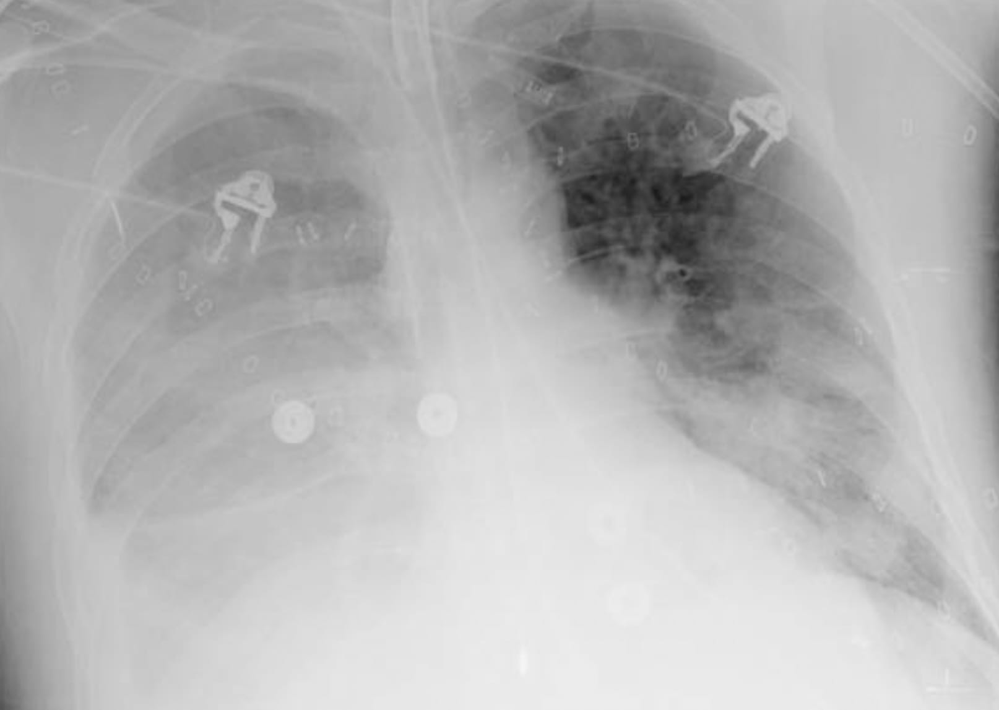

```{r setup, include = FALSE}
options(htmltools.dir.version = FALSE)
library(knitr)
library(metathis)
library(xaringanExtra)
library(showtext)
library(kableExtra)
library(icons)
opts_chunk$set(echo=FALSE)

# set engines
knitr::knit_engines$set("markdown")

xaringanExtra::use_panelset()
# xaringanExtra::use_share_again()
xaringanExtra::use_tile_view()

```

```{r xaringan-themer, include=FALSE, warning=FALSE}
library(xaringanthemer) 
style_mono_light(base_color = "#23395b")
```

```{r meta, echo=FALSE}
meta() %>%
  meta_general(
    description = "A thoracic case conference",
  ) %>% 
  meta_name("github-repo" = "howardm") %>% 
  meta_social(
    title = "Case Conference",
    url = "https://howardm.github.io/CaseConferenceJanuary11th2022",
    image = "http://chestradiologists.org/twitter-card3.jpg",
    image_alt = "",
    og_type = "website",
    og_author = "Howard Mann",
    twitter_card_type = "summary_large_image",
    twitter_creator = "@howardm19"
  )
```  


class: inverse, center, middle

### Thoracic Case Conference

### *Things go the wrong way*


### .blue[Howard Mann, M.D.]


```{r icon-style}
icon_style(fontawesome("link"), scale = 1, fill = "white")
```
howardmann.us


### January 11th, 2022


---
class: center, middle


<!----------------------------- SLIDE BREAK ----------------------------->

---

layout: true

background-image: url(images/circle-cropped.png)
background-position: 98% 1%
background-size: 4%

---

class: middle

.bigger[Follow along at:   

https://howardm.github.io/CaseConferenceJanuary11th2022]


<!----------------------------- SLIDE BREAK ----------------------------->
---
class: inverse
name: case1

.blue[Case 1]

.panelset[

.panel[.panel-name[Clinical Presentation]

.big[A patient in the Neurosurgical I.C.U.]

] <!--end of panel-->

.panel[.panel-name[Imaging I]

Day 7 

.center[]

] <!--end of panel-->

.panel[.panel-name[Imaging II]

<br>

.pull-left[]

.pull-right[]

] <!--end of panel-->

.panel[.panel-name[Explanation]

<br>

.pull-left[

The imaging findings are those of extensive necrotizing pneumonia: multilobar consolidative opacities with areas of caviation (.red[red circle]).

Diagnosis: nosocomial (ventilator-associated) pneumonia caused by *Staph. aureus*.

Other bacteria that may cause this are *Pseudomonas aeruginosa* and *Enterobacter species*.

.grey[Key point:

The rapid development of consolidation with areas of cavitation are very suggestive of this diagnosis.]

]

.pull-right[]


] <!--end of panel-->


] <!--end of panelset-->

<!----------------------------- SLIDE BREAK ----------------------------->

---
class: inverse
name: case2

.blue[Case 2]

.panelset[

.panel[.panel-name[Clinical Presentation]

.big[A patient in an I.C.U. with new fever and leukocytosis]

] <!--end of panel-->

.panel[.panel-name[Imaging I]

.center[]

] <!--end of panel-->

.panel[.panel-name[Imaging II]

.center[]

] <!--end of panel-->

.panel[.panel-name[Explanation]


<br>

.pull-left[

This is very similar to the previous case.

Findings of necrotizing pneumonia (.red[p]) with a para-pneumonic effusion (.red[e]) are present. 

The pleural fluid should be sampled to determine whether an empyema is present.

.small[.grey[Key point:

In my view, the CT should always be perfomed as a contrast-enhanced examination. This greatly facilitates 1) the distinction between atelectatic (which enhances uniformly, as opposed to consolidated lung) and consolidated lung, 2) the perception of foci of internal necrosis/abscess formation, and 3) the distinction between consolidated lung and pleural fluid.  ]]

]

.pull-right[]


] <!--end of panel-->


] <!--end of panelset-->

<!----------------------------- SLIDE BREAK ----------------------------->

---

class: inverse
name: case3

.blue[Case 3]

.panelset[

.panel[.panel-name[Clinical Presentation]

.big[Imaging in an outpatient clinic. 

A patient with a persistent cough, indolent fever, and putrid sputum.]

] <!--end of panel-->

.panel[.panel-name[Imaging I]

.center[]

] <!--end of panel-->

.panel[.panel-name[Imaging II]

.pull-left[

<br>

CT after radiography

]

.pull-right[

<br>

3 months later

]

] <!--end of panel-->

.panel[.panel-name[Explanation]

<br>

.big[In this outpatient, the imaging findings are not those of a usual community-acquired necrotizing pneumonia.

Unlike ordinary community-acquired bacterial pneumonia, this did not resolve in the usual fashion, and culminated in a chronic abscess for which a lobectomy was ultimately performed.

The indolent fever (without rigors) and putrid sputum suggest a possible mixed aerobe-anaerobe microbial etiology.]


] <!--end of panel-->


] <!--end of panelset-->

<!----------------------------- SLIDE BREAK ----------------------------->

---

class: inverse
name: case4

.blue[Case 4]

.panelset[

.panel[.panel-name[Clinical Presentation]

.big[Imaging in an outpatient clinic. 

A patient with a 2-week cough and low-grade fever]

] <!--end of panel-->

.panel[.panel-name[Imaging I]

.center[]

] <!--end of panel-->

.panel[.panel-name[Imaging II]

<br>

.center[]

] <!--end of panel-->


.panel[.panel-name[Explanation]

<br>

.pull-left[

.big[This is very similar to the previous case (clinical presentation and imaging).

The findings are those of a focal necrotizing pneumonia with abscesses (.red[a]) and a focus of cavitation (.red[c]).]

]

.pull-right[

.center[]

]

] <!--end of panel-->


] <!--end of panelset-->

<!----------------------------- SLIDE BREAK ----------------------------->

---

class: inverse
name: case5

.blue[Case 5]

.panelset[

.panel[.panel-name[Clinical Presentation]

.big[A patient in a long-term-care residential facility.

She has a persistent productive cough, chest pain, and fever.]

] <!--end of panel-->

.panel[.panel-name[Imaging I]

.center[]


] <!--end of panel-->


.panel[.panel-name[Imaging II]

.center[]


] <!--end of panel-->

.panel[.panel-name[Explanation]

<br>

.pull-left[

This is another case similar to the previous two.

A pneumothorax is also present.

Note the presence of opacified bronchi in the left lower lobe (.red[circle]). 

What does this suggest in terms of possible pathogenesis (particularly in a -- presumably elderly -- resident of a long-term care facility ) ?

]

.pull-right[

.center[]

]

] <!--end of panel-->


] <!--end of panelset-->

<!----------------------------- SLIDE BREAK ----------------------------->

---

class: inverse
name: case6

.blue[Case 6]

.panelset[

.panel[.panel-name[Clinical Presentation]

.big[A patient imaged in the E.D.]

] <!--end of panel-->


.panel[.panel-name[Imaging I]

11 a.m.

.center[]

] <!--end of panel-->

.panel[.panel-name[Imaging II]

2:15 p.m. A CTPA was performed.

<br>

.pull-left[]

.pull-right[]

] <!--end of panel-->


.panel[.panel-name[Explanation]

<br>

.pull-left[

Imaging findings (new from earlier radiography):

* findings of obstructive right middle lobe, right lower lobe, and left lower lobe atelectasis
* fluid-distended esophagus (.red[e])
* fluid in large bronchi, such as the right lower lobe bronchus (.red[arrow])

What happened in the E.D. ?]

.pull-right[

.center[]
]


] <!--end of panel-->


] <!--end of panelset-->

<!----------------------------- SLIDE BREAK ----------------------------->

---

class: inverse
name: case7

.blue[Case 7]

.panelset[

.panel[.panel-name[Clinical Presentation]

.big[A patient with metastatic cancer.

Bedside chest radiography for acute respiratory distress.]

] <!--end of panel-->

.panel[.panel-name[Imaging I]


.pull-left[

Current image

]

.pull-right[

Prior for comparison

]

] <!--end of panel-->

.panel[.panel-name[Imaging II]

<div style="text-align:center;">
<iframe class="pacsbin"
         id="case7"
         src="https://www.pacsbin.com/c/bkjajr61aD?s=61d8c72b2b0cfe01bc97410a&i=61d8c72b2b0cfe01bc974145&ww=952&wc=225&an=false&header=false&notes=false&overlay=false" 
         style="width: 500px; height: 500px; border: 0;"></iframe>
</div>

] <!--end of panel-->


.panel[.panel-name[Explanation]

<br>

.pull-left[Findings:

* new multifocal, multilobar ground glass-attenuating and consolidative opacities.
* fluid-distended stomach (.red[s]) and esophagus (.red[e]). 

These observations permit a straightforward diagnosis -- reminiscent of the previous case. 


]


.pull-right[

.center[]


]

] <!--end of panel-->


] <!--end of panelset-->

<!----------------------------- SLIDE BREAK ----------------------------->

---

class: inverse
name: case8

.blue[Case 8]

.panelset[

.panel[.panel-name[Clinical Presentation]

.big[Acute respiratory distress in a hospitalized patient.]

] <!--end of panel-->

.panel[.panel-name[Imaging I]

.center[]

] <!--end of panel-->

.panel[.panel-name[Imaging II]

<div style="text-align:center;">
<iframe class="pacsbin"
         id="case8"
         src="https://www.pacsbin.com/c/byBrWp616v?s=61d8d2c12b0cfe01bc9742fa&i=61d8d2c12b0cfe01bc974357&ww=683&wc=65&an=false&header=false&notes=false&overlay=false" 
         style="width: 500px; height: 500px; border: 0;"></iframe>
</div>

] <!--end of panel-->

.panel[.panel-name[Explanation]

<br>

.pull-left[

Findings:

* the dominant abnormality is extensive right lower lobe opacities, consistent with consolidated and/or atelectatic lung

* a key image is on the right: extensive opacity is present within the lumens of right (in particular) and left lower lobe segmental bronchi -- in the .red[boxes]. A notable absence of air is present in these airways.

]

.pull-right[

.center[]

]


] <!--end of panel-->


] <!--end of panelset-->

<!----------------------------- SLIDE BREAK ----------------------------->

---

class: inverse
name: case9

.blue[Case 9]

.panelset[

.panel[.panel-name[Clinical Presentation]

.big[Acute respiratory distress occurred during an outpatient medical procedure]

] <!--end of panel-->

.panel[.panel-name[Imaging]

.pull-left[


]

.pull-right[


]

] <!--end of panel-->

.panel[.panel-name[Additional information]

<br>

.big[The procedure was a colonoscopy.

Can you now account for the morphology and distribution of the opacities ?]


] <!--end of panel-->

.panel[.panel-name[Diagnosis]
<br>

.big[Aspiration of gastric contents -- ? gastric fluid/ acid -- while in the left side-down decubitus position]

] <!--end of panel-->


] <!--end of panelset-->

<!----------------------------- SLIDE BREAK ----------------------------->

---
class: inverse
name: case10

.blue[Case 10]

.panelset[

.panel[.panel-name[Clinical Presentation]

.big[Cough episodes in the months after bariatric surgery]

] <!--end of panel-->

.panel[.panel-name[Imaging]

<div style="text-align:center;">
<iframe class="pacsbin"
         id="case10"
         src="https://www.pacsbin.com/c/W1Qb0rAyaP?s=61d8e1282b0cfe01bc9746ab&i=61d8e1282b0cfe01bc9746ac&ww=1775&wc=-495&an=false&header=false&notes=false&overlay=false" 
         style="width: 500px; height: 500px; border: 0;"></iframe>
</div>

] <!--end of panel-->

.panel[.panel-name[Explanation]

<br>

.pull-left[

Findings:

* confluent consolidative opacities are present in the right lower lobe.
* minimal airway-centric opacity is present in the left lower lobe.

A key finding: intra-luminal material in right lower lobe bronchi, surrounded by luminal air -- within the .red[circles].

]

.pull-right[

.center[]

]

] <!--end of panel-->

] <!--end of panelset-->

<!----------------------------- SLIDE BREAK ----------------------------->

---

class: inverse
name: case11

.blue[Case 11]

.panelset[

.panel[.panel-name[Clinical Presentation]

.big[Sporadic episodes of respiratory distress]

] <!--end of panel-->

.panel[.panel-name[Imaging]

<div style="text-align:center;">
<iframe class="pacsbin"
         id="case11"
         src="https://www.pacsbin.com/c/byIV9zRkTv?s=61d8dc002b0cfe01bc97449d&i=61d8dc002b0cfe01bc974577&ww=1695&wc=-628&an=false&header=false&notes=false&overlay=false" 
         style="width: 500px; height: 500px; border: 0;"></iframe>
</div>

] <!--end of panel-->

.panel[.panel-name[Explanation I]

.pull-left[

.small[The key finding in this case is subtle: the presence of tubular, branching (at ~2 mm intervals) opacities in the lower lobes -- in the .red[circles] in the left lower lobe.

These represent material in the lumens of centrilobular bronchioles.]

.pull-left[

.grey[Bronchial and bronchiolar anatomy]]

.pull-right[

]

.small[Use MIPS to identify and characterize these opacities.]]

.pull-right[

.center[]

]


] <!--end of panel-->

.panel[.panel-name[Explanation II]

.big[Diagnosis; Aspiration bronchiolitis

These are *tree-in-bud* opacities without the buds!]


] <!--end of panel-->

] <!--end of panelset-->

<!----------------------------- SLIDE BREAK ----------------------------->

---

class: inverse
name: case12

.blue[Case 12]

.panelset[

.panel[.panel-name[Clinical Presentation]

.big[This patient is being evaluated for waxing-and-waning pulmonary nodules.]

] <!--end of panel-->

.panel[.panel-name[Imaging]

.pull-left[

Current image

]

.pull-right[

5 months ago

]

] <!--end of panel-->

.panel[.panel-name[Explanation I]

.pull-left[Apparently spontaneous waxing-and-waning of focal nodular opacities is interesting!

If one of these were biopsied, it would show the pathology alongside. 

.yellow[I know we're not pathologists  :-)]

How would this comport with the theme of this Case Conference ?]

.pull-right[


pink stuff  = fibroblastic tissue plug in lumens of respiratory bronchioles and distal.


]
 
] <!--end of panel-->

.panel[.panel-name[Explanation II]

.big[Diagnosis: Organizing Pneumonia]


] <!--end of panel-->

] <!--end of panelset-->

<!----------------------------- SLIDE BREAK ----------------------------->

---

class: inverse
name: case13

.blue[Case 13]

.panelset[

.panel[.panel-name[Clinical Presentation]

.big[Imaging after unintentional ingestion of a liquid]

] <!--end of panel-->

.panel[.panel-name[Imaging I]

.center[]


] <!--end of panel-->

.panel[.panel-name[Imaging II]

<br>

.center[]

] <!--end of panel-->

.panel[.panel-name[Explanation]

.pull-left[Findings:

* focal opacities within which foci of cavitation are present.

Hydrocarbons result in  a severe chemical pneumonitis and necrosis.]

.pull-right[

Not an ideal moonlighting activity:


<br>
<br>

.smallest[Credit: Mohamed Nohassi at unsplash.com]
]

] <!--end of panel-->
] <!--end of panelset-->

<!----------------------------- SLIDE BREAK ----------------------------->

---

class: inverse
name: case14

.blue[Case 14]

.panelset[

.panel[.panel-name[Clinical Presentation]

.big[Imaging evaluation of a chronic cough]

] <!--end of panel-->

.panel[.panel-name[Imaging]

.pull-left[

]

.pull-right[

.center[]]

] <!--end of panel-->

.panel[.panel-name[Explanation]

<br>

.pull-left[Key observation:

* the opacity contains fat (.red[circle])

Diagnosis: Exogenous Lipoid Pneumonia

This is known to occur after repeated aspiration of oils, such as certain laxatives.

This may manifest as:

* nodule
* mass-like lesion, simulating cancer
* consolidative opacity]

.pull-right[

]

] <!--end of panel-->

] <!--end of panelset-->

<!----------------------------- SLIDE BREAK ----------------------------->

---

class: inverse
name: case15

.blue[Case 15]

.panelset[

.panel[.panel-name[Clinical Presentation]

.big[Cough evaluation in a young child]

] <!--end of panel-->

.panel[.panel-name[Imaging ]

<br>

.center[]

] <!--end of panel-->

.panel[.panel-name[Explanation]

.pull-left[Findings:

* obstructive left upper lobe atelectasis (collapse)
* the offending item is visible -- .red[circle]

Diagnosis: foreign body aspiration -- a tooth]

.pull-right[


]


] <!--end of panel-->

] <!--end of panelset-->

<!----------------------------- SLIDE BREAK ----------------------------->

---

class: inverse
name: case16

.blue[Case 16]

.panelset[

.panel[.panel-name[Clinical Presentation]

.big[A sixteen-year-old with a chronic, intermittent cough and "chest discomfort."]

] <!--end of panel-->

.panel[.panel-name[Imaging I]

<br>

.center[]

] <!--end of panel-->

.panel[.panel-name[Imaging II]

.pull-left[

]

.pull-right[

.center[]]

] <!--end of panel-->

.panel[.panel-name[Explanation]

.pull-left[

Findings:

* opacity within the right lower lobe associated with volume loss
* a high-attenuation object in a segmental bronchus -- .red[circle]

Diagnosis: Obstructive atelectasis

]

.pull-right[

.pull-left[


.small[A *vampire tooth* of a Halloween past.]]


.pull-right[

]

]

] <!--end of panel-->

] <!--end of panelset-->

<!----------------------------- SLIDE BREAK ----------------------------->

---

class: middle

.big[.blue[Summary of bronchopulmonary aspiration syndromes]]

Consider the context in which aspiration occurs and the nature of the aspirated material.

.center[]

<!----------------------------- SLIDE BREAK ----------------------------->

---

class: middle

.center[]

<!----------------------------- SLIDE BREAK ----------------------------->


```{css echo=FALSE}
.highlight-last-item > ul > li, 
.highlight-last-item > ol > li {
  opacity: 0.2;
}
.highlight-last-item > ul > li:last-of-type,
.highlight-last-item > ol > li:last-of-type {
  opacity: 1;
}
```
